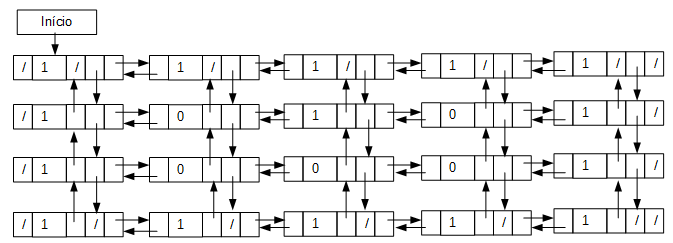

# Path Finder

This project implements a dynamically allocated matrix, reads this [file](data/labirinto.txt) that contains a maze and solve it, where:

- 5 is the entry
- 9 is the exit
- 1 is a wall
- 0 is a possible path
- 4 is a accomplished path

## ☁️ Links

- [Matrix Specifications](docs/pdf/matrix_specification.pdf)
- [Maze Specifications](docs/pdf/maze_specification.pdf)

## 💻 Project

#### Matrix Structure



#### Initial Maze


#### Solved Maze


## 🚀 Technologies

 Java

## 🏃 Usage

Before you start the server theres some commands that you have to run, just copy and paste one by one the commands bellow:

```
git clone https://github.com/douglasJovenil/path-finder
cd path-finder/src
javac Main.java
java Main
```
